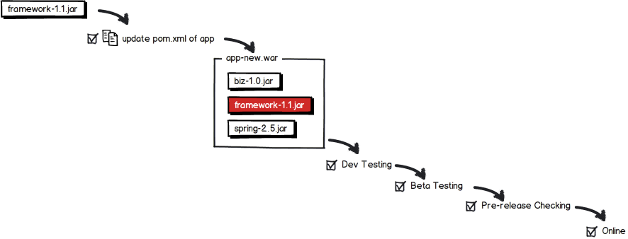

Why we created phoenix?
=======================

Goal
----
* Enable core & third-party java libraries (which java apps depends on) to update independently.

Current Situation
-----------------
The classical packaging & deployment strategy looks like this: 

If we update framework library from 1.0 to 1.1:

